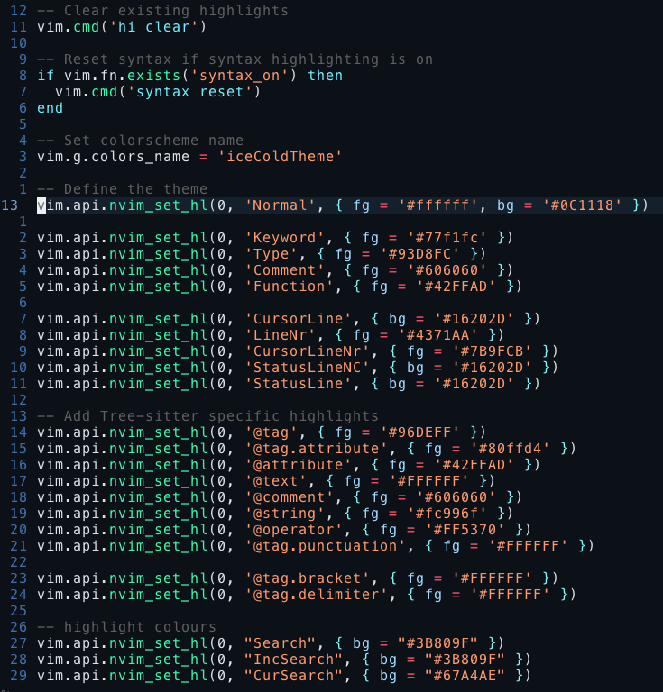

# Ice Cold Theme For Neovim



![screenshot of theme in vue or html5] (vueScreenshot.png)

## About
This theme has primarily blue hues, but for some things, it felt necessary to retain their traditional colours. For example, strings should be orangey, functions green, and and operators red. This creates a blue look and feel to the theme, without sacrificing readability.
## Installation
This is a very simple theme, so does not require any plugin manager to install.

Simply download the iceColdTheme.lua file, and place it in the following directory.
For mac and linux:
```
~/.config/nvim/colors/
```

Then in add this line to your init.lua file

```.lua
vim.cmd[[colorscheme iceColdTheme]]
```

## Cursor Line Styling
If you want your cursor line to be highlighted as shown in the screenshot above, add the following line to your init.lua file.

```.lua
vim.cmd('set cursorline')
```
